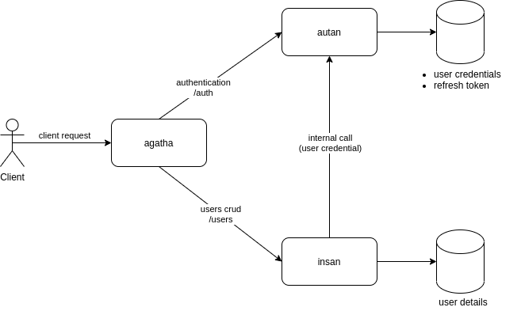
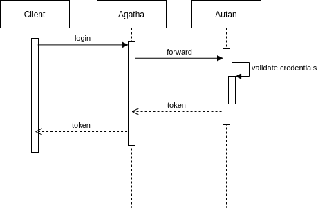
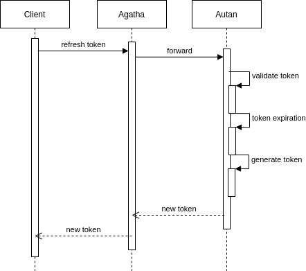
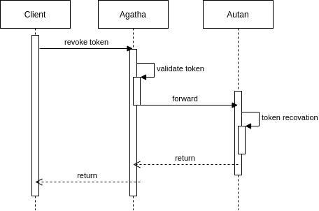
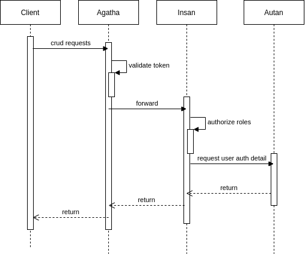

# Agatha

Agatha is a simple api gateway that fronted [Autan](https://github.com/imamfzn/autan) and [Insan](https://github.com/imamfzn/insan).

# Dependencies

* [Autan](https://github.com/imamfzn/autan), to authenticate client, generate refresh token, and revoke refresh token.
* [Insan](https://github.com/imamfzn/insan), all CRUD operation about user details.

# API Spec / Documentation

Let's look api documentation at https://agatha0.herokuapp.com/docs. That documentation is deployed on Heroku free tier. So at the first time you entering that web / endpoint, it will be really slow. If u got timeout, just refresh / retry again your request :).

# How-To
Below is how to spin up all services in our local environment. It's recomended to spin up using docker-compose.

## With docker-compose

1. clone Agatha, [Autan](https://github.com/imamfzn/autan), and [Insan](https://github.com/imamfzn/insan)
2. build all images:
  ```bash
  # in autan directory
  docker build -t autan:0.1.0 .

  # in insan directory
  docker build -t insan:0.1.0 .

  # in agatha directory
  docker build -t agatha:0.1.0 .
  ```
3. spin up docker compose from Agatha directory
  ```bash
  # in agatha directory
  docker-compose -f docker-compose.dev.yml -p sejutacita up
  ```
4. after all container already running, run seed script to init admin and basic user account via `Insan` container (look at `docker ps` to know the name of `Insan` container).
  ```bash
  docker exec -it <INSAN CONTAINER NAME> /bin/sh -c 'SEED_PASSWORD=rahasiabanget node script/seed.js'
  ```
5. open up `http://localhost:8000/docs` from your browser, it should be show up swagger documentation
6. let's try to login with our seed account
  ```
  # admin role
  username: ultraman
  password: rahasiabanget

  # user role
  username: gatotkaca
  password: rahasiabanget
  ```
7. for more information about all endpoints, just look at swagger documentation on `http://localhost:8000/docs`

8. Good Luck!

## Without Docker
1. Download / clone this repository
2. Setup [Autan](https://github.com/imamfzn/autan)
3. Setup [Insan](https://github.com/imamfzn/insan)
4. Install all package dependencies `npm install`
5. Setup all env values (look at `env.sample`)
6. Run `npm start`

# Service Architecture


# Flow

## Login


## Refresh Token


## Revoke Token


## CRUD


